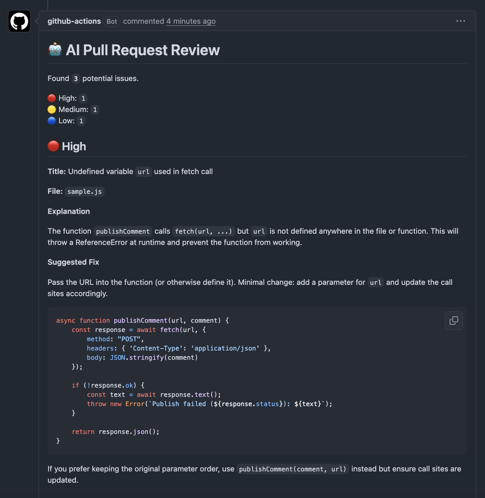

# AI PR Reviewer

An AI-powered GitHub Action that reviews pull-request changes and posts actionable feedback directly on the pull request.

AI PR Reviewer automates the first pass of a pull-request review, helping developers catch potential issues while keeping them in control of the final decision.

## Features

- Runs automatically when a pull request is opened, updated, or reopened.
- Reviews only the code changed in the pull request.
- Focuses on actionable issues while avoiding unnecessary suggestions.
- Posts a formatted review comment on the pull request and updates it on later runs.

## Example review

## How it works

1. GitHub Actions checks out the pull request and generates its diff.
2. The pull-request diff is sent to OpenAI with a focused code-review prompt.
3. The generated review is posted as a comment on the pull request.
4. On subsequent runs, the existing AI review comment is updated.

## Built With

- JavaScript (Node.js)
- GitHub Actions
- OpenAI API
- GitHub REST API

## Design Decisions

### Review only the pull request diff

The reviewer analyzes only the code changed in the pull request rather than the entire repository. This keeps reviews focused, reduces token usage, and minimizes API costs. The tradeoff is that supporting code outside the diff may not always be available to the model.

### Update existing review comments

Instead of creating a new comment for every workflow run, the action updates its existing review comment. This keeps pull requests organized and ensures reviewers always see feedback for the latest changes without accumulating duplicate comments.

### Conservative review strategy

The review prompt prioritizes correctness, security, and performance issues while avoiding speculative feedback, style preferences, and unnecessary refactoring suggestions. The goal is to provide actionable recommendations with a low false-positive rate.
